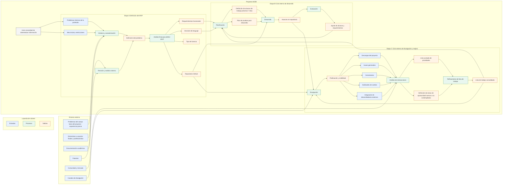

```mermaid
graph LR
  %% =========================================================
  %% LEYENDA
  %% =========================================================
  subgraph L[Leyenda de colores]
    L1[Entradas]
    L2[Procesos]
    L3[Salidas]
  end

  %% =========================================================
  %% EXTERNO (FUERA DEL PROYECTO)
  %% =========================================================
  subgraph X[Entorno externo]
    XE1[Problemas del campo fuera del proyecto - experiencia previa]
    XE2[Entrevistas a usuarios finales y profesionistas]
    XE3[Documentación académica]
    XE4[Patentes]
    XE5[Comunidad y mercado]
    XE6[Canales de divulgación]
  end

  %% =========================================================
  %% INTERNO (DENTRO DEL PROYECTO)
  %% =========================================================
  subgraph P[Proyecto AUDD]
    A0[Inicio necesidad de sistematizar información]

    %% -------------------------
    %% ETAPA A DEFINICIÓN MVP
    %% -------------------------
    subgraph A[Etapa A Definición del MVP]
      A_IN2[Problemas internos de la profesión]
      A_IN3[Idea inicial y restricciones]

      A_P1[Síntesis y caracterización]
      A_P2[Revisión y análisis externo]

      A_OUT0[Definición del problema]

      A_P3[Análisis final para definir MVP]

      A_OUT1[Requerimientos funcionales]
      A_OUT2[Decisión de lenguaje]
      A_OUT3[Tipo de licencia]
      A_OUT4[Repositorio GitHub]
    end

    %% -------------------------
    %% ETAPA B CICLO INTERNO PROFUNDIZADO
    %% -------------------------
    subgraph B[Etapa B Ciclo interno de desarrollo]
      B_P1[Planificación]
      B_OUT1[Definición de alcance de trabajo próximos 7 días]
      B_OUT2[Plan de pruebas post desarrollo]
      B_P2[Desarrollo]
      B_OUT3[Avances en repositorio]
      B_P3[Evaluación]
      B_OUT4[Ajuste de alcance y requerimientos]

      B_P1 --> B_OUT1
      B_P1 --> B_OUT2
      B_OUT1 --> B_P2
      B_OUT2 --> B_P2
      B_P2 --> B_OUT3
      B_OUT3 --> B_P3
      B_P3 --> B_OUT4
      B_OUT4 --> B_P1
    end

    %% -------------------------
    %% ETAPA C CICLO EXTERNO PROFUNDIZADO
    %% -------------------------
    subgraph C[Etapa C Ciclo externo de divulgación y mejora]
      C_P1[Divulgación]
      C_OUT1[Publicación y visibilidad]

      C_IN1a[Descargas del proyecto]
      C_IN1b[Issues generados]
      C_IN1c[Comentarios]
      C_IN1d[Solicitudes de cambio]
      C_IN1e[Integración de desarrolladores externos]

      C_P2[Análisis de interacciones]

      C_OUT2a[Lista acotada de prioridades]
      C_OUT2b[Definición de áreas de oportunidad nuevas o no contempladas]

      C_P3[Refinamiento de lista de trabajo]
      C_OUT3[Lista de trabajo consolidada]

      C_P1 --> C_OUT1
      C_OUT1 --> C_IN1a
      C_OUT1 --> C_IN1b
      C_OUT1 --> C_IN1c
      C_OUT1 --> C_IN1d
      C_OUT1 --> C_IN1e

      C_IN1a --> C_P2
      C_IN1b --> C_P2
      C_IN1c --> C_P2
      C_IN1d --> C_P2
      C_IN1e --> C_P2

      C_P2 --> C_OUT2a
      C_P2 --> C_OUT2b

      C_OUT2a --> C_P3
      C_OUT2b --> C_P3
      C_P3 --> C_OUT3
      C_OUT3 --> C_P1
    end

  end

  %% =========================================================
  %% FLUJOS ENTRE EXTERNO E INTERNO
  %% =========================================================
  %% Entradas externas que alimentan Etapa A
  XE1 --> A_P1
  XE2 --> A_P1
  XE3 --> A_P2
  XE4 --> A_P2

  %% Entradas internas base de Etapa A
  A0 --> A_IN2
  A0 --> A_IN3
  A_IN2 --> A_P1
  A_IN3 --> A_P1

  %% Documento intermedio: Definición del problema
  A_P1 --> A_OUT0
  A_P2 --> A_OUT0
  A_OUT0 --> A_P3

  %% Salidas del análisis final (MVP)
  A_P3 --> A_OUT1
  A_P3 --> A_OUT2
  A_P3 --> A_OUT3
  A_P3 --> A_OUT4

  %% Etapa A alimenta Etapa B (lenguaje y requerimientos)
  A_OUT1 --> B_P1
  A_OUT2 --> B_P1
  A_OUT4 --> B_P2

  %% Avances internos alimentan Etapa C (repositorio público con progreso)
  B_OUT3 --> C_P1
  A_OUT4 --> C_P1

  %% Etapa C regresa a Etapa B (prioridades externas al plan interno)
  C_OUT3 --> B_P1
  XE5 --> C_P2
  XE6 --> C_P1

  %% =========================================================
  %% COLORES
  %% =========================================================
  %% Azul Entradas
  style L1 fill:#E8F1FF,stroke:#2B4C7E
  style XE1 fill:#E8F1FF,stroke:#2B4C7E
  style XE2 fill:#E8F1FF,stroke:#2B4C7E
  style XE3 fill:#E8F1FF,stroke:#2B4C7E
  style XE4 fill:#E8F1FF,stroke:#2B4C7E
  style XE5 fill:#E8F1FF,stroke:#2B4C7E
  style XE6 fill:#E8F1FF,stroke:#2B4C7E
  style A_IN2 fill:#E8F1FF,stroke:#2B4C7E
  style A_IN3 fill:#E8F1FF,stroke:#2B4C7E
  style C_IN1a fill:#E8F1FF,stroke:#2B4C7E
  style C_IN1b fill:#E8F1FF,stroke:#2B4C7E
  style C_IN1c fill:#E8F1FF,stroke:#2B4C7E
  style C_IN1d fill:#E8F1FF,stroke:#2B4C7E
  style C_IN1e fill:#E8F1FF,stroke:#2B4C7E

  %% Verde Procesos
  style L2 fill:#E9F7EF,stroke:#1E7E34
  style A_P1 fill:#E9F7EF,stroke:#1E7E34
  style A_P2 fill:#E9F7EF,stroke:#1E7E34
  style A_P3 fill:#E9F7EF,stroke:#1E7E34
  style B_P1 fill:#E9F7EF,stroke:#1E7E34
  style B_P2 fill:#E9F7EF,stroke:#1E7E34
  style B_P3 fill:#E9F7EF,stroke:#1E7E34
  style C_P1 fill:#E9F7EF,stroke:#1E7E34
  style C_P2 fill:#E9F7EF,stroke:#1E7E34
  style C_P3 fill:#E9F7EF,stroke:#1E7E34

  %% Amarillo Salidas
  style L3 fill:#FFF4E6,stroke:#B85C00
  style A_OUT0 fill:#FFF4E6,stroke:#B85C00
  style A_OUT1 fill:#FFF4E6,stroke:#B85C00
  style A_OUT2 fill:#FFF4E6,stroke:#B85C00
  style A_OUT3 fill:#FFF4E6,stroke:#B85C00
  style A_OUT4 fill:#FFF4E6,stroke:#B85C00
  style B_OUT1 fill:#FFF4E6,stroke:#B85C00
  style B_OUT2 fill:#FFF4E6,stroke:#B85C00
  style B_OUT3 fill:#FFF4E6,stroke:#B85C00
  style B_OUT4 fill:#FFF4E6,stroke:#B85C00
  style C_OUT1 fill:#FFF4E6,stroke:#B85C00
  style C_OUT2a fill:#FFF4E6,stroke:#B85C00
  style C_OUT2b fill:#FFF4E6,stroke:#B85C00
  style C_OUT3 fill:#FFF4E6,stroke:#B85C00

  %% Inicio
  style A0 fill:#F5F5F5,stroke:#333,stroke-width:1px
```